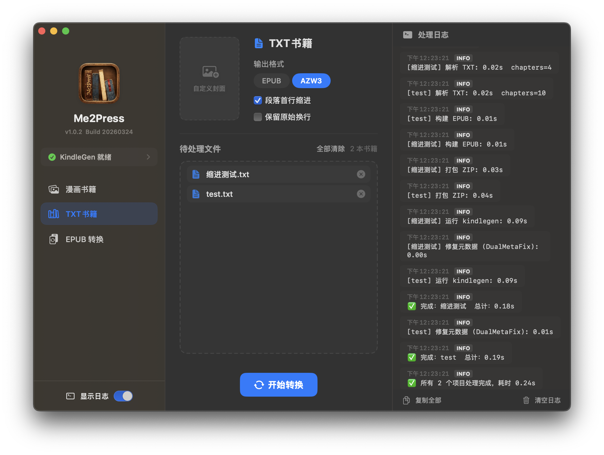
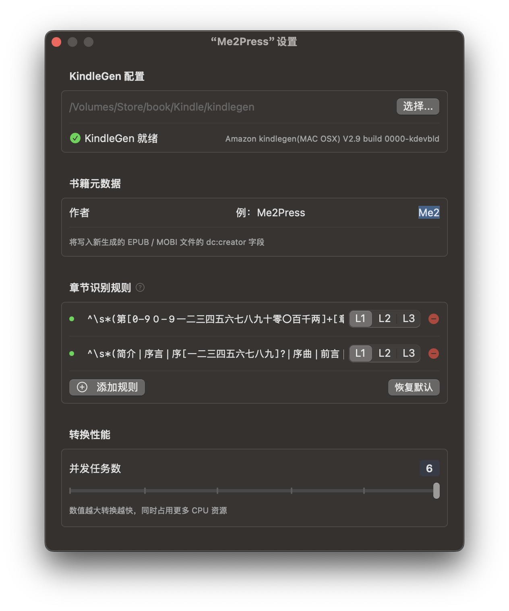

# Me2Press

 

[English](README.md) | [中文](docs/README_zh.md)

Me2Press is a macOS tool for preparing Kindle-ready books locally — converting TXT novels, image folders (comics), and EPUB files into formats you can send directly to your Kindle. Built mainly for personal use.

## 📸 Screenshots

  
  

## ✨ Features

**Text Book**: TXT → EPUB / AZW3
- Chapter detection via customizable regex rules, with multi-level heading support
- Auto-generated cover; custom cover image supported
- Optional first-line indent and original line break preservation
- Auto-detects encoding: UTF-8 / GB18030 / UTF-16

**Comic Book**: Image folder → MOBI (fixed layout)
- Drop a folder of images to pack it as one MOBI; drop a parent folder to auto-expand and batch-process its subfolders
- Auto-splits into volumes (`Vol.1` / `Vol.2` …) when total image size exceeds 380 MB
- Packing logic references [KCC](https://github.com/ciromattia/kcc) (packaging only, no image processing); I use [Me2Comic](https://github.com/DawnLiExp/Me2Comic) to prepare images beforehand

**EPUB Book**: EPUB → AZW3
- Converts existing EPUB files to AZW3 format

All three modes support:
- Concurrent processing (1–6 tasks)
- Batch input with reorderable queue
- MOBI/AZW3 metadata fix (CDEType / ASIN) for proper Kindle library recognition

## 🖥 Requirements

- macOS 14+
- kindlegen (required for AZW3 / MOBI output, not needed for EPUB): install [Kindle Previewer](https://www.amazon.com/Kindle-Previewer/b?ie=UTF8&node=21381691011) to get it, or download the standalone binary from archive.org

## 🛠 Built With

- Swift 6 + SwiftUI with strict concurrency
- `@Observable` for state management
- Structured concurrency (async/await, TaskGroup)
- CoreGraphics / CoreText for cover generation (no AppKit dependency)

## 🙏 Acknowledgements

Comic packaging format references [KCC (Kindle Comic Converter)](https://github.com/ciromattia/kcc).
